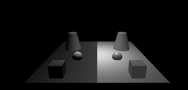

# lights 

For light demonstration I will use a scene with different material. On the left there are objects with lambertMaterial, on the right with basicMaterial.  

  
  

### No light

Without a light source you can only see the basic material.

  

### Ambient light

This adds an ambiental light, not to basicMaterial though.

  

    //subtle red ambient light
    var ambientLight = new THREE.AmbientLight(0x660000);
    scene.add(ambientLight);

  

### Directional light

This adds a directional light (e.g. sun light) to the scene. A color and an intensity can be set. Optinal you can set the direction from where the light is coming by setting the position. In this example from the upper right. 

  

    //directional light
    var directionalLight = new THREE.DirectionalLight(0xffffff,1);
    directionalLight.position.set(1, 0, 1).normalize();
    scene.add(directionalLight);

### Hemisphere light

Hemisphere light is similar to directional light, but you can add a sky color and a ground color to it.

  

    //hemisphere light
    var hemisphereLight = new THREE.HemisphereLight(0xffffff,0xff0000,1);
    hemisphereLight.position.set(1, 0, 1).normalize();
    scene.add(hemisphereLight);

### Point light

Point light effects lambert and phong (left) materials. Color, intensity and distance can be set.

  

    var pointLight = new THREE.PointLight( 0xffffff,1 );
    pointLight.position.set( 0, 0, 3 );
    scene.add( pointLight );

### Spot light

Is similar to PointLight but can cast shadows in one direction.

  

    var spotLight = new THREE.SpotLight( 0xffffff,1 );
    spotLight.position.set( 0, 0, 10 );
    scene.add( spotLight );

